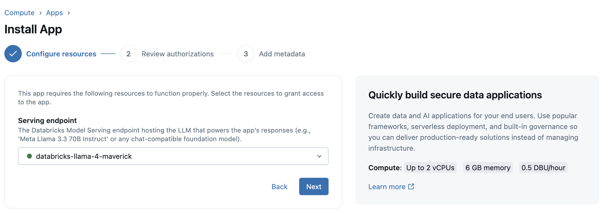
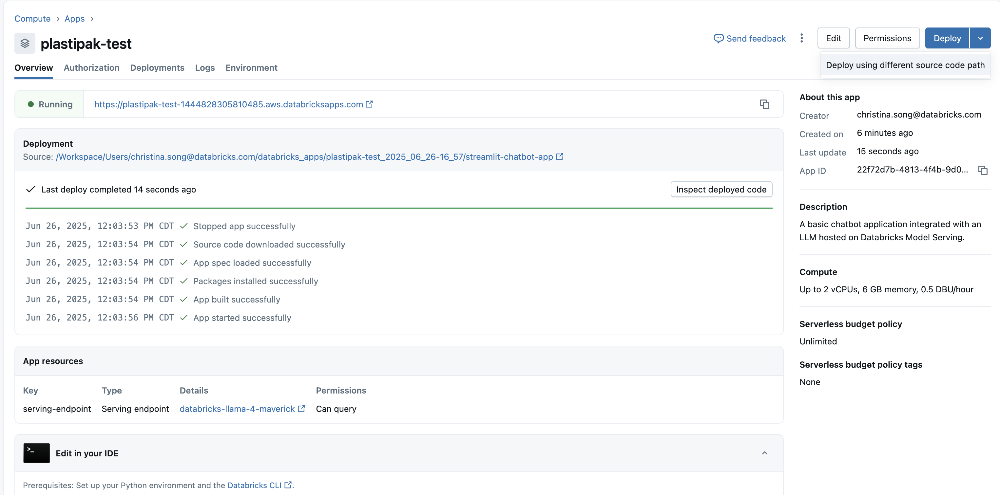

# Plastipak AI Assistant Demo 

A secure, internal chat interface for Plastipak that provides document upload, summarization, and extraction capabilities using Databricks. This application offers a ChatGPT-like experience while maintaining enterprise-grade security and governance.

## 🎯 Overview

This demo showcases an internal chat interface that allows Plastipak employees to:
- Upload and analyze documents (PDF, DOCX, TXT, MD)
- Ask questions about uploaded content
- Get AI-powered responses about packaging solutions
- Maintain secure, private document handling with Azure Active Directory integration

## ✨ Key Features

### AI-Powered Chat Interface
- **ChatGPT-like Experience**: Modern, intuitive chat interface with real-time responses
- **Document Analysis**: Upload and extract text from multiple document formats
- **Context-Aware Responses**: AI assistant provides relevant answers based on uploaded documents
- **Conversation History**: Maintain chat sessions with document context

### Document Processing
- **Multi-Format Support**: PDF, DOCX, TXT, and Markdown files
- **Text Extraction**: Automatic extraction and processing of document content
- **Context Integration**: Seamless integration of document content into chat conversations

### Security & Governance
- **Azure AD Integration**: User authentication and access control via Azure Active Directory
- **Private Document Handling**: All uploaded documents remain within Plastipak's secure environment
- **User Session Management**: Individual user sessions with proper isolation
- **Enterprise-Grade Security**: No external API calls to third-party services

## 🏗️ Technical Architecture

### Backend Infrastructure
- **Databricks Model Serving**: Uses Databricks LLM endpoints (Llama-4-Maverick)
- **Stateless Design**: Scalable architecture that can be deployed on-premises or in cloud

### Frontend Technology
- **Streamlit**: Modern web interface with responsive design
- **Custom Styling**: Plastipak-branded UI with professional appearance
- **Real-time Updates**: Dynamic chat interface with immediate response display


## 🚀 Deployment Options

### Databricks-Native Deployment
- Deploy directly within Databricks workspace
- Leverage existing Databricks infrastructure
- Integrated with Databricks security and governance

### On-Premises Deployment
- Self-hosted solution for maximum security
- Complete control over data and infrastructure
- Integration with existing enterprise systems

## 📋 Prerequisites

### System Requirements
- Python 3.8+
- Databricks workspace with model serving capabilities
- Azure Active Directory for authentication

### Dependencies
```
mlflow>=2.21.2
streamlit==1.44.1
databricks-sdk
PyMuPDF
python-docx
```

## 🚀 Getting Started

### Testing Locally
1. **Git clone in your IDE or preferred workspace.**

2. **Deploy Application**
   ```bash
   # Install dependencies
   pip install -r requirements.txt
   
   # Run the application
   streamlit run app.py
   ```

### Develop and run the Databricks app locally

1. **Clone the app template repository:**
   ```bash
   git clone https://github.com/databricks/app-templates 
   ```

2. **Install the required libraries:**
   ```bash
   cd e2e-chatbot-app
   pip install -r requirements.txt
   ```

3. To make calls to the agent endpoint, you must **authenticate to your Databricks workspace.** Generate a personal access token and save the token value.

4. **Configure the Databricks CLI:**
   ```bash
   databricks configure
   ```
5. Provide the **Databricks host** url for your workspace: https://hostname.cloud.databricks.com and the **Personal access token** from earlier.

6. Specify the model serving endpoint name and run the app. To find the model serving endpoint name, go to your workspace and select **Serving** to see a list of model serving endpoints:
   ```bash
   export SERVING_ENDPOINT=databricks-llama-4-maverick
   streamlit run app.py
   ```

### Deploying in Databricks

1. **Setup your Databricks Environment**
- Git clone in Databricks
   - Workspace > Create > Git folder > copy & paste Git repository URL
   - Create Git Folder

- Create the app via Databricks UI
   - Click **Compute** in the sidebar
   - Go to the **Apps** tab > select **Create app** in top right corner
   - Select **Streamlit tab** under Create new app > **Chatbot**
   - Select **Serving endpoint: databricks-llama-4-maverick** > Install

   

2. **Deploy the app using Databricks UI**
   - Toggle the **Deploy** button > Select **Deploy using different source code path**

   

   - Select file with sourcecode
   - **Deploy**
   - Click on the link next to **Running** to access the deployed app


